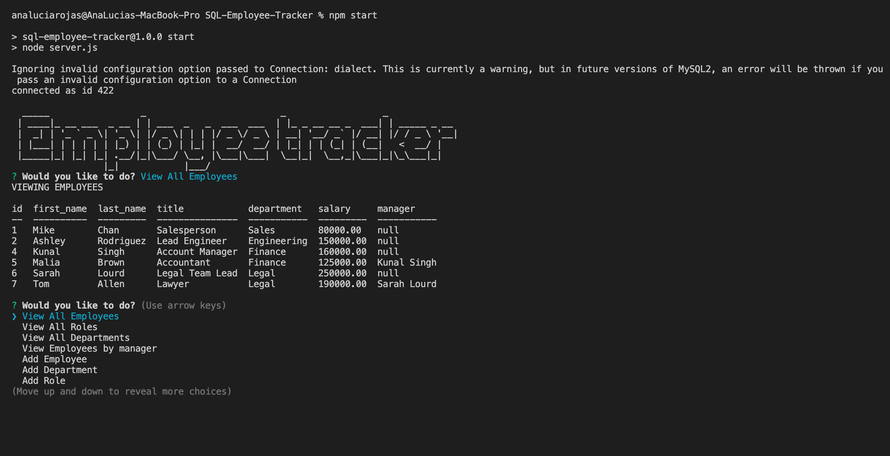

# SQL Employee Tracker


## Description

This project consisted on creating a command-line application from scratch to manage a company's employee database, using Node.js, Inquirer, and MySQL.

## Table of Contents

* [Installation](#installation)
* [Snippets](#snippets)
* [Technologies](#technologies)
* [Preview](#preview)
* [Links](#links)

## Installation 

1. Clone the repository to your machine 

```bash
git clone https://github.com/analuciarojas/SQL-Employee-Tracker.git
```

2. Install corresponding dependencies (MySql 2, Inquierer, figlet, etc. ) for example: 

```bash
npm install inquierer
```

3. Sign into MySql and create database employee_DB, then follow the next steps

```
CREATE DATABASE employee_DB;
```

```
USE employee_DB;
```

```
SOURCE db/schema.sql;
```

```
SOURCE db/seed.sql;
```

4. Run npm start

```bash
npm start
```


## Snippets 

* **Seed file employees**
```            
INSERT INTO employee (first_name, last_name, role_id, manager_id)
VALUES ("Mike", "Chan", 9, NULL),
    ("Ashley", "Rodriguez", 3, NULL),
    ("Kevin", "Tupik", 1, 2),
    ("Kunal", "Singh", 5, NULL),
    ("Malia", "Brown", 4, 4),
    ("Sarah", "Lourd", 10, NULL),
    ("Tom", "Allen", 11, 6);


SELECT * FROM employee;
```   
* **Schema file table roles**
```            
CREATE TABLE role (
  id INT NOT NULL AUTO_INCREMENT PRIMARY KEY,
  title VARCHAR(30) NOT NULL,
  salary DECIMAL(20, 2) NULL,
  department_id INT NOT NULL,
  FOREIGN KEY (department_id)
        REFERENCES department(id)
        ON DELETE CASCADE ON UPDATE CASCADE
);
```  
* **Add department function**
```            

 // Adding new department to database
const addDepartment = () => {
    // Department question
    let questions = [
      {
        type: "input",
        name: "name",
        message: "what is the new department name?"
      }
    ];
  
    inquier.prompt(questions)
    .then(response => {
        // Add department to other departments
      const query = `INSERT INTO department (name) VALUES (?)`;
      connection.query(query, [response.name], (err, res) => {
        if (err) throw err;
        console.log(`Congrats! We could succesfully insert ${response.name} as a new department with ID ${res.insertId}`);
        startPrompt();
      });
    })
    .catch(err => {
      console.error(err);
    });
  }
```           


## Technologies

* JavaScript
* Node.js
* Inquirer
* Express.js
* MySql
* MySql2 

## Preview

This is a an image of a team profile deployed HTML file using this application.  



## Links

* [URL of the Youtube walktrough video](https://youtu.be/oX1NmrXa88g)

* [URL of the GitHub repository](https://github.com/analuciarojas/SQL-Employee-Tracker)